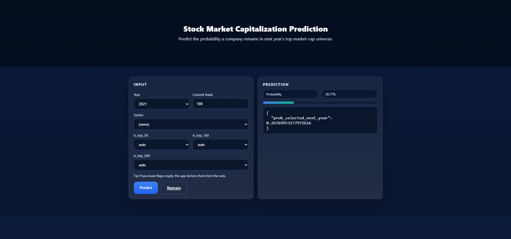

# Stock Market Capitalization Prediction

An end-to-end ML web app that predicts the probability a company remains in next year's top market-cap universe. Built with FastAPI + scikit-learn and your CSV data.

## Preview

Place your UI screenshot at `app\static\Web-Interface.png` and it will show below:



## Features
- Blue/white themed responsive UI with hero image and progress bar
- Dropdown-based inputs: Year, Sector; numeric input: Rank; auto-derived flags
- Prediction via Logistic Regression pipeline (StandardScaler + OneHotEncoder)
- One-click retraining (POST `/api/train` or button)
- Artifacts persisted to `artifacts/`

## Data
Expected CSVs located at `Quant_Intern/Assignemnt/`:
- `assignment_mcap.csv` – market-cap ranks per year (wide format)
- `assignment_sector_data.csv` – sector mapping (`CO_NAME`,`Sector`)
- `assignment_investment_rules.csv` – retained for completeness (not required for v1 model)

## How it works
- We melt `assignment_mcap.csv` into long format `(CO_NAME, year, rank)` and join `Sector`.
- Features: `year`, `rank`, derived `is_top_50`, `is_top_100`, `is_top_500`, and `Sector`.
- Target: whether the same stock is in top-500 the following year.
- Model: LogisticRegression(class_weight="balanced") inside a Pipeline with preprocessing.

## Getting started (Local)
1) Python 3.10+
2) Create venv and install deps
```powershell
python -m venv .venv
.\.venv\Scripts\Activate.ps1
python -m pip install --upgrade pip
pip install -r requirements.txt
```
3) Ensure data files exist
```
Quant_Intern/Assignemnt/assignment_mcap.csv
Quant_Intern/Assignemnt/assignment_sector_data.csv
```
4) Run the app
```powershell
uvicorn app.main:app --host 127.0.0.1 --port 8000
```
5) Open `http://127.0.0.1:8000` in your browser

6) Optional: Background & screenshot
- Background image: place `app/static/background.jpg`
- UI screenshot: place `app/static/Web-Interface.png` so it appears in this README

## API
- GET `/health` – service status
- POST `/api/train` – retrain and persist new model
- POST `/api/predict` – JSON payload; UI uses HTML form at `/predict`

## Project structure
```
app/
  main.py            # FastAPI app
  static/            # CSS, images (background.jpg, hero.svg), screenshot (Web-Interface.png)
  templates/
    index.html       # Frontend
ml/
  config.py          # Paths & constants
  dataset.py         # Dataset builder
  train.py           # Training pipeline & persistence
  predict.py         # Inference
Quant_Intern/
  Assignemnt/        # CSV data (required)
artifacts/           # Saved model & metadata (created at runtime)
requirements.txt
README.md
```

## Notes
- First run will train automatically if `artifacts/model.joblib` is missing
- You can refine the target/feature set by editing `ml/dataset.py` and retraining
